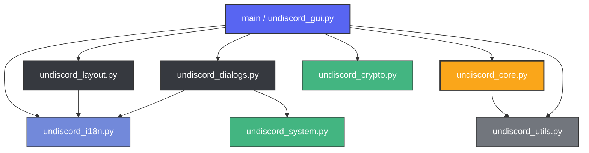

# Undiscord Python GUI Dashboard - Project Navigator

이 문서는 AI 에이전트 및 개발자가 프로젝트의 전체 구조와 각 모듈별 책임을 쉽고 빠르게 파악할 수 있도록 돕는 아키텍처 지도(Navigator)입니다.

---

## 📐 아키텍처 개요

본 프로젝트는 **독립적인 역할 분담(Separation of Concerns)** 원칙 하에 설계되어 있으며, 크게 **UI 계층**, **보안/시스템 계층**, **코어 엔진 계층**의 3단계로 분리되어 있습니다.

---

## 📂 모듈별 역할 및 명세

### 1. UI 및 컨트롤러 계층 (User Interface & Controller)

*   **[undiscord_gui.py](file:///d:/Antigravity/undiscord/undiscord/undiscord_gui.py)**
    *   **역할**: 애플리케이션의 **컨트롤러(Controller)** 및 메인 실행 진입점입니다.
    *   **상세 기능**:
        *   비동기 작업 처리를 위한 백그라운드 스레드 제어 및 모니터링
        *   `config.json` 로컬 설정 파일 입출력 관리 및 마스터 비밀번호 인증 라이프사이클 총괄
        *   엔진 메시지 큐로부터 실시간 삭제/검색 진행 상태를 수신하여 UI 컴포넌트 동기화
*   **[undiscord_layout.py](file:///d:/Antigravity/undiscord/undiscord/undiscord_layout.py)**
    *   **역할**: UI 대시보드 화면의 **레이아웃 디자인 및 스타일 시트 구성**을 담당합니다.
    *   **상세 기능**:
        *   디스코드 스타일의 다크 테마 색상 및 ttk 스타일 명세
        *   토큰 입력창, ID 입력창, 날짜 범위 선택창, 프로그레스바, 제어 버튼 등 핵심 위젯 배치
        *   🌐 실시간 한영 다국어 전환 버튼 제공 및 전체 텍스트 동적 갱신 (`update_ui_texts`)
*   **[undiscord_dialogs.py](file:///d:/Antigravity/undiscord/undiscord/undiscord_dialogs.py)**
    *   **역할**: 보안 인증용 **비밀번호 입출력 모달(Modal) 다이어로그**를 렌더링합니다.
    *   **상세 기능**:
        *   마스터 비밀번호 설정(`set`) 및 입력(`enter`)을 유도하는 최상단 강제 포커스 윈도우 생성
        *   선택된 언어에 동기화하여 비밀번호 기입 라벨 명세화
        *   Caps Lock 및 한영키 활성화 여부를 다국어 대응하여 하단에 실시간 경고 안내

### 2. 코어 비즈니스 엔진 (Core Business Engine)

*   **[undiscord_core.py](file:///d:/Antigravity/undiscord/undiscord/undiscord_core.py)**
    *   **역할**: Discord HTTP API와 직접 통신하여 검색 및 삭제 연산을 제어하는 **핵심 엔진(Engine)**입니다.
    *   **상세 기능**:
        *   오프셋 기반 디스코드 메시지 검색 및 응답 JSON 파싱
        *   정규식 매칭, 고정 메시지 여부, 채널 형태에 기반한 메시지 유효성 필터링
        *   Rate Limit(HTTP 429) 및 서버 인덱싱(HTTP 202) 발생 시 안전 쿨다운 후 자동 재시도
        *   다중 채널 처리 시 배치(`run_batch`) 작업 파이프라인 관리

### 3. 시스템 및 암호화 지원 계층 (System & Crypto Helpers)

*   **[undiscord_crypto.py](file:///d:/Antigravity/undiscord/undiscord/undiscord_crypto.py)**
    *   **역할**: 보안에 중요한 토큰 정보를 로컬 보관하기 위한 **암복호화 서비스**를 담당합니다.
    *   **상세 기능**:
        *   `cryptography` 라이브러리의 동적 자동 검사 및 설치 지원
        *   PBKDF2-HMAC-SHA256 알고리즘을 사용한 마스터 비밀번호 기반 32바이트 키 유도 (`derive_key`)
        *   Fernet 대칭키 암복호화 및 패스워드 일치성 판정용 검증 값 생성
*   **[undiscord_system.py](file:///d:/Antigravity/undiscord/undiscord/undiscord_system.py)**
    *   **역할**: Windows OS 커널의 입력 상태를 호출하는 **시스템 인터페이스**입니다.
    *   **상세 기능**:
        *   `ctypes`를 사용하여 Caps Lock의 활성화 토글 상태 검사
        *   IME(입력기) 기본 윈도우 핸들에 메시지를 보내 현재 입력 모드가 한글(한영키 켜짐)인지 실시간 체크
*   **[undiscord_i18n.py](file:///d:/Antigravity/undiscord/undiscord/undiscord_i18n.py)**
    *   **역할**: 다국어 표시 및 OS 로케일 감지를 제어하는 **번역 리소스 센터**입니다.
    *   **상세 기능**:
        *   사용자 OS 표시 언어가 한국어 계열인지 자동 판단하여 기본 언어 설정
        *   모든 프레임 라벨, 터미널 로그, 대화상자 경고, 3탭 도움말 텍스트의 한국어/영어 번역 사전 사전정의
*   **[undiscord_utils.py](file:///d:/Antigravity/undiscord/undiscord/undiscord_utils.py)**
    *   **역할**: 독립적으로 재사용 가능한 **공통 유틸리티 헬퍼** 모음입니다.
    *   **상세 기능**:
        *   시간 및 Snowflake ID 상호 변환 기능 (`ms_to_hms`, `to_snowflake`)
        *   상대 시각 드롭다운 기반 날짜 시간 포맷 산출 (`calculate_relative_date`)
        *   위조 피싱 도메인 전송 방지를 위한 디스코드 공식 API 도메인 보안 검사 (`validate_discord_url`)
        *   PyInstaller 가상 패키징 경로와 로컬 개발 경로 매핑 (`resource_path`)
