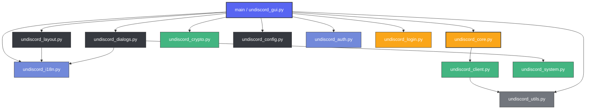

# Undiscord Python GUI Dashboard - Project Navigator

이 문서는 AI 에이전트 및 개발자가 프로젝트의 전체 구조와 각 모듈별 책임을 쉽고 빠르게 파악할 수 있도록 돕는 아키텍처 지도(Navigator)입니다.

---

## 📐 아키텍처 개요

본 프로젝트는 **독립적인 역할 분담(Separation of Concerns)** 원칙 하에 설계되어 있으며, 크게 **UI 계층**, **보안/설정 계층**, **코어 엔진 계층**으로 분리되어 있어 순환 참조 없이 단방향 의존성 트리를 이룹니다.

---

## 📂 모듈별 역할 및 명세

### 1. UI 및 이벤트 바인딩 계층 (User Interface & Controllers)

*   **[undiscord_gui.py](file:///D:/Antigravity/ClearDiscord/undiscord_gui.py)**
    *   **역할**: 애플리케이션의 **이벤트 바인딩 핸들러 및 기동 통합 진입점**입니다.
    *   **상세 기능**:
        *   비동기 삭제 스레드 관리 및 터미널 스크롤 로그 데이터 실시간 스트리밍
        *   설정 파일 입출력 및 토큰 복호화 흐름을 전담 유틸 모듈로 위임하여 렌더링에만 집중
        *   `--login` 매개변수 감지 시 간편 로그인 서브프로세스 팝업 연동
        *   **토큰 노출 원천 차단**: GUI 상에서 토큰 입력 즉시 마스킹 문자열(`••••••••••••••••`)로 화면 표시를 감추고 메모리 상의 안전한 세션 변수에 저장
        *   **기동 시 보안 갱신 제어**: 시작 시 백그라운드 스레드에서 원격 SSL 핀 목록 동적 갱신 작업 지시
        *   **로그 마스킹 및 백업 UX 연동**: 설정된 메시지 마스킹(`maskChatLog`) 및 지운 메시지 백업 옵션을 UI 체크박스 상태와 실시간 바인딩
*   **[undiscord_layout.py](file:///D:/Antigravity/ClearDiscord/undiscord_layout.py)**
    *   **역할**: UI 대시보드 화면의 **레이아웃 디자인 및 스타일 시트 구성**을 담당합니다.
    *   **상세 기능**:
        *   디스코드 스타일의 다크 테마 색상 및 ttk 스타일 명세
        *   토큰 입력창, ID 입력창, 날짜 범위 선택창, 프로그레스바, 제어 버튼 등 핵심 위젯 배치
        *   🌐 실시간 한영 다국어 전환 버튼 제공 및 전체 텍스트 동적 갱신 (`update_ui_texts`)
*   **[undiscord_dialogs.py](file:///D:/Antigravity/ClearDiscord/undiscord_dialogs.py)**
    *   **역할**: 보안 인증용 **비밀번호 입출력 모달(Modal) 다이어로그**를 렌더링합니다.
    *   **상세 기능**:
        *   마스터 비밀번호 설정(`set`) 및 입력(`enter`)을 유도하는 최상단 강제 포커스 윈도우 생성
        *   Caps Lock 및 한영키 활성화 여부를 다국어 대응하여 하단에 실시간 경고 안내

### 2. 세션 설정 및 기동 지원 계층 (Config & Subprocess Handlers)

*   **[undiscord_login.py](file:///D:/Antigravity/ClearDiscord/undiscord_login.py)**
    *   **역할**: `pywebview` 라이브러리를 사용해 안전하게 디스코드 로그인 페이지를 띄우고 토큰을 자동 가로채는 **간편 로그인 전담 서브프로세스** 모듈입니다.
    *   **상세 기능**:
        *   보안 탐지를 우회하기 위한 Chrome 데스크톱 브라우저 User-Agent 위장
        *   iframe LocalStorage 우회 기법 및 Webpack Chunk Injection 방식 듀얼 가동
        *   획득한 토큰을 일회용 대칭키로 AES-GCM 암호화하여 표준 출력으로 전달 (보안을 위해 일회용 대칭 키 `ENV_SEC_KEY`가 누락된 평문 전송 폴백은 전면 차단됨)
*   **[undiscord_config.py](file:///D:/Antigravity/ClearDiscord/undiscord_config.py)**
    *   **역할**: 로컬 `config.json` 설정 파일의 **저장 및 불러오기 파일 입출력 서비스**를 담당합니다.
    *   **상세 기능**:
        *   대시보드 위젯 입력값을 JSON으로 내보내고 부팅 시 위젯의 상태 값을 그대로 복원
        *   최초 기동 시 강제 보안 경고/면책 동의 다이얼로그(Disclaimer) 확인 흐름 전담
*   **[undiscord_auth.py](file:///D:/Antigravity/ClearDiscord/undiscord_auth.py)**
    *   **역할**: 토큰 복원 시 **비밀번호 질문 모달 제어 및 토큰 데이터 복호화 수명 주기**를 전담합니다.
    *   **상세 기능**:
        *   암호 유도 및 복호화 실패 시 재시도 횟수 제한(3회 초과 시 강제 차단 및 초기화) 통제
        *   복구된 임시 평문 토큰 문자열을 수집 즉시 안전하게 물리 메모리상에서 소거하도록 조정

### 3. 코어 엔진 및 네트워크 계층 (Core Engines & HTTP Clients)

*   **[undiscord_core.py](file:///D:/Antigravity/ClearDiscord/undiscord_core.py)**
    *   **역할**: API 스캔 및 삭제 파이프라인 처리를 수행하는 **핵심 비즈니스 엔진(Engine)**입니다.
    *   **상세 기능**:
        *   메시지 검색 오프셋 산출 및 조건(날짜, 정규식, 첨부파일 등) 필터 적용
        *   Rate Limit(HTTP 429) 및 디스코드 서버 인덱싱(HTTP 202) 발생 시 자동 대기 및 재시도
        *   **내 채팅 내용 마스킹**: 마스킹 활성화 시 GUI 및 삭제 확인 팝업창에서 삭제할 메시지 내용을 `●●● (마스킹됨)` 처리하여 스크린 노출로 인한 정보 누출 방지
        *   다중 채널 처리 시 비동기 배치(`run_batch`) 큐 제어
*   **[undiscord_client.py](file:///D:/Antigravity/ClearDiscord/undiscord_client.py)**
    *   **역할**: 디스코드 HTTP API 통신 시 사설 인증서를 통한 패킷 감청을 차단하는 **SSL 피닝(Certificate Pinning) 탑재 네트워크 클라이언트**입니다.
    *   **상세 기능**:
        *   SSL/TLS 핸드셰이크 시 서버 인증서의 SHA-256 지문을 수집하여 공인 핀 목록과 강제 매칭
        *   중간자 공격(MITM) 시도 시 즉시 소켓을 폐쇄하여 통신 도청을 차단
        *   **비대칭키 서명 검증 기반 동적 SSL 피닝 갱신**: GitHub의 배포처 원격 레포지토리로부터 Ed25519 서명 검증을 마친 실시간 SSL 인증서 핀 목록(`cert_pins.json`)을 안전하게 받아와 동적 업데이트 처리 (실패 시 내장 기본 핀으로 안전하게 Fallback)
        *   참여 중인 서버 및 채널 목록 조회 전역 유틸리티 (`fetch_guilds`, `fetch_channels`) 전담

### 4. 보안 및 공통 지원 계층 (Security & General Utilities)

*   **[undiscord_crypto.py](file:///D:/Antigravity/ClearDiscord/undiscord_crypto.py)**
    *   **역할**: 토큰 및 IPC 데이터 암호화를 제어하는 **대칭키 암호화 및 메모리 보호 지원 모듈**입니다.
    *   **상세 기능**:
        *   마스터 비밀번호 기반 AES-256-GCM 알고리즘 데이터 암복호화
        *   부모-자식 프로세스 간 표준 출력(stdout) 도청 방지용 일회용 임시 AES-GCM 암복호화 (`encrypt_ipc`)
        *   **비대칭키 서명 검증**: 원격지 정보의 위변조 방지를 위한 Ed25519 단방향 서명 검증 루틴 (`verify_ed25519_signature`) 구현
        *   `ctypes`를 사용하여 메모리 힙 상에 생존하는 토큰 평문 버퍼의 강제 제로화 (`wipe_memory_string`)
*   **[undiscord_system.py](file:///D:/Antigravity/ClearDiscord/undiscord_system.py)**
    *   **역할**: Windows OS API를 호출하여 Caps Lock 및 IME 한국어 입력 토글 상태를 감지하는 **시스템 브릿지**입니다.
*   **[undiscord_i18n.py](file:///D:/Antigravity/ClearDiscord/undiscord_i18n.py)**
    *   **역할**: OS 로케일 자동 판정 및 UI 라벨, 다국어 로그 사전 리소스를 보관하는 **번역 센터**입니다.
*   **[undiscord_utils.py](file:///D:/Antigravity/ClearDiscord/undiscord_utils.py)**
    *   **역할**: 스노우플래이크 변환, 날짜 오프셋 연산, 디스코드 공인 API URL 여부 검사 등 **공통 유틸리티 헬퍼** 모음입니다.
